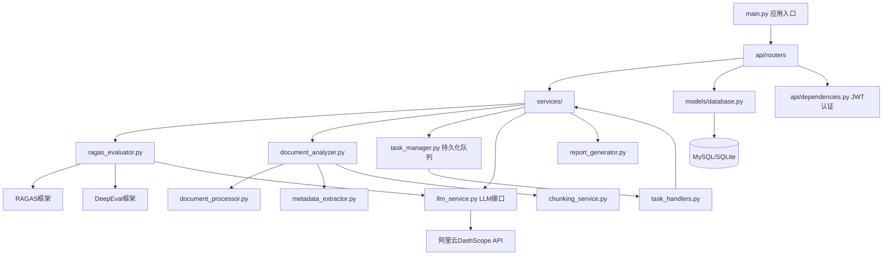

# 保险行业 RAG 评估系统 — 代码分析报告

> 分析时间：2026-05-07  
> 分析范围：`D:\AIAI\AIAI\new` 工作区全量代码

---

## 1. 项目概览

### 项目名称
**保险行业 RAG 评估系统**（Insurance Industry RAG Evaluation System）

### 主要编程语言与依赖框架

| 层次 | 语言 | 核心框架/库 |
|------|------|------------|
| 后端 | Python 3.12 | FastAPI 0.109、SQLAlchemy 2.0、Pydantic v2 |
| 前端 | TypeScript + Vue 3 | Vite、Vue Router 4、Pinia、Element Plus |
| 评估引擎 | Python | ragas 0.1.2、deepeval 3.9.7、langchain-openai、dashscope |
| 文档解析 | Python | PyMuPDF、python-docx、openpyxl、python-pptx |
| 数据库 | SQL | MySQL（主力）/ SQLite（轻量开发） |
| AI 模型接入 | API | 阿里云通义千问（DashScope），兼容 OpenAI 接口规范 |

### 解决的核心问题

该项目专为**保险行业**的 RAG（Retrieval-Augmented Generation）问答系统提供端到端的自动化质量评估能力，解决以下痛点：

1. **评估门槛高**：将 ragas/deepeval 等复杂评估框架封装为可视化 SaaS 平台，降低使用门槛。
2. **知识库质量难量化**：通过 6 项单轮指标（答案相关性、忠实度、检索精确性等）和 4 项多轮指标（知识保留、角色遵从等）对 RAG 管道进行立体评分。
3. **测试集构造繁琐**：提供基于 LLM 的全自动测试集生成（单轮+多轮），支持从业务文档中提取 QA 对。
4. **评估成本不透明**：内置 API Token 用量追踪，精确统计每个模块的 LLM 调用消耗。

---

## 2. 代码结构与模块划分

### 主要目录职责

```
new/
├── backend/                      # Python FastAPI 后端
│   ├── main.py                   # 应用入口：注册路由、中间件、生命周期钩子
│   ├── config/
│   │   ├── settings.py           # Pydantic-Settings 全局配置（DB URL、CORS、密钥）
│   │   └── database.py           # SQLAlchemy 引擎与 Session 工厂
│   ├── models/database.py        # ORM 数据模型定义（12 张核心表）
│   ├── schemas.py                # Pydantic 请求/响应 Schema
│   ├── api/
│   │   ├── routers/              # 8 个路由模块（auth/documents/testsets/evaluations/
│   │   │                         #   reports/config/analysis/usage）
│   │   └── dependencies.py       # JWT 认证依赖注入
│   └── services/                 # 业务逻辑层（15+ 服务）
│       ├── document_processor.py    # 多格式文档解析（PDF/DOCX/XLSX/PPTX/TXT）
│       ├── document_analyzer.py     # 文档分析流水线编排
│       ├── metadata_extractor.py    # LLM 驱动的元数据/提纲提取
│       ├── chunking_service.py      # 智能文档切片（策略模式）
│       ├── context_selector.py      # 上下文选择器（RAG 核心）
│       ├── advanced_testset_generator.py  # 高级 QA 测试集生成
│       ├── conversation_case_generator.py # 多轮对话 Case 生成
│       ├── conversation_executor.py       # 多轮对话执行（驱动被测系统）
│       ├── ragas_evaluator.py      # 评估核心（RAGAS + DeepEval 双引擎）
│       ├── report_generator.py     # HTML/PDF 评估报告生成
│       ├── llm_service.py          # LLM 统一接口 + Token 用量记录
│       ├── config_service.py       # 用户 API 配置 CRUD
│       ├── task_manager.py         # 数据库持久化异步任务队列
│       └── task_handlers.py        # 任务类型分发器
│
├── frontend/src/                 # Vue 3 TypeScript 前端
│   ├── views/                    # 11 个页面视图
│   ├── components/               # 可复用业务组件
│   ├── stores/                   # Pinia 状态管理（auth/document/testset/evaluation/task）
│   ├── api/                      # Axios HTTP 客户端封装
│   ├── router/index.ts           # 路由配置（含路由守卫认证）
│   └── composables/              # Vue Composable 工具钩子
│
├── docs/                         # 技术设计文档
│   ├── multi_turn_wbs.md         # 多轮评估工作分解
│   └── testset_generator_technical_doc.md
└── category_hierarchy.json       # 保险产品分类层次结构
```

### 模块依赖关系



### 应用入口点

- **后端**：`backend/main.py` → `uvicorn main:app --port 8001`
- **前端**：`frontend/src/main.ts` → `vite dev`（开发）/ `vite build`（生产）
- **API 基础路径**：`/api/v1/{auth|documents|testsets|evaluations|reports|config|analysis|usage}`

---

## 3. 核心功能实现

### 3.1 文档处理流水线（DocumentAnalyzer）

**处理链**：上传文件 → 格式识别 → 文本提取 → LLM 元数据/提纲分析 → 智能切片 → 入库

```
DocumentProcessor.process_file()
    ├── process_pdf()   # PyMuPDF + PyPDF2
    ├── process_docx()  # python-docx
    ├── process_xlsx()  # openpyxl
    └── process_pptx()  # python-pptx

MetadataExtractor       # 调用 Qwen 提取：标题、摘要、产品实体、分类
ChunkingService         # 基于提纲的策略切片
    ├── GeneralChunkingStrategy  # 通用固定窗口
    └── OutlineChunkingStrategy  # 章节感知切片（主力）
```

切片设计亮点：使用 `SequenceMatcher` 模糊查找将切片内容精确映射回原文坐标（`start_char / end_char`），保证位置可追溯。

---

### 3.2 测试集生成（AdvancedTestSetGenerator + ConversationCaseGenerator）

**单轮 QA 生成**：
1. 按文档提纲选取上下文切片（`context_selector.py`）
2. 通过 Qwen 模型按类型（事实型/推理型/开放型）生成 QA 对
3. 通过 `_classify_chinese_type()` 对中文问题做二次分类纠正
4. 写入 `questions` 表，关联到测试集

**多轮 Case 生成**（`ConversationCaseGenerator`）：
1. `conversation_chunk_selector` 按 case_type 比例（`single_chunk_deep` / `same_doc_chain` / `cross_doc_assoc`）选取切片簇
2. 使用专用 Prompt（`PROMPT_MULTI_TURN_CASE_GENERATION`）批量生成多轮对话脚本（含依赖类型：contextual/referential/accumulative）
3. 输出带 `dependency_type` 标注的多轮 `ConversationTurn` 序列，写入 `conversation_test_cases/conversation_turns` 表

---

### 3.3 评估引擎（RagasEvaluator）—— 核心类

评估器统一入口 `RagasEvaluator.evaluate()` 的处理流：

```
evaluate(questions, engine?)
  ↓
_configure_llm_environment()   # 从数据库读取用户 Qwen API Key
  ↓
if engine == "deepeval":
    _evaluate_with_deepeval_rows()    # 并发10线程，每题独立 LLMTestCase
        ↓ QwenDeepEvalLLM（DeepEvalBaseLLM子类）
        ↓ AnswerRelevancyMetric / FaithfulnessMetric / ...
        ↓ _translate_reason_to_zh()  # 英文理由自动翻译为中文
else:
    _evaluate_with_ragas_rows()
        ↓ 注入 ChatOpenAI(Qwen) + DashscopeLCEmbeddings
        ↓ ragas.evaluate(HFDataset)
  ↓
_calculate_overall_metrics()   # mean/std/min/max/median + 加权综合分
```

**多轮对话评估**（`evaluate_conversations()`）：
- 不直接使用 DeepEval 官方多轮 API
- 使用**自研提示词层**（`_build_conversation_eval_prompt`）调用 Qwen，返回 case 级 + turn 级 JSON 评分
- 支持 4 项指标：`knowledge_retention / conversation_relevancy / conversation_completeness / role_adherence`

---

### 3.4 持久化任务队列（TaskManager）

```
HTTP 请求 → Router → submit_task() → 写 background_tasks 表（status=pending）
                                              ↓
                                    PersistentTaskPoller（守护线程，轮询间隔 1s）
                                              ↓
                                    _claim_next_task()  # 数据库乐观加锁
                                              ↓
                                    ThreadPoolExecutor（max 4 workers）
                                              ↓
                                    task_handlers.run_task_handler()
                                              ↓
                              task_manager.ensure_not_cancelled()  # 协作式取消
```

特色：
- 服务重启时自动将 `running/cancelling` 状态重置为 `pending`，防止任务卡死
- 每个 `task_type` 在 `task_handlers.py` 中注册独立 handler，遵循开放/封闭原则
- 日志保留最近 200 条，防止无限增长

---

### 3.5 数据流总览（时序）

```
用户  →  前端Vue  →  POST /api/v1/documents/upload
                          ↓
                    DocumentService.upload_and_process()
                    [异步任务] DocumentAnalyzer.analyze_document()
                          ↓
                    Chunk 写入 document_chunks 表
                          ↓
         POST /api/v1/testsets/{id}/generate
                    [异步任务] AdvancedTestSetGenerator.generate()
                    Question 写入 questions 表
                          ↓
         POST /api/v1/evaluations  
                    [异步任务] RagasEvaluator.evaluate_batch()
                    EvaluationResult 写入 evaluation_results 表
                          ↓
         GET /api/v1/reports/{id}
                    ReportGenerator.generate_html_report()
                    前端渲染指标可视化
```

---

## 4. 代码作用与价值

### 在整体系统中的位置

该项目是一个**独立的 SaaS 式 RAG 评估平台**，位于被测 RAG 系统外部。通过调用被测系统的 HTTP 接口（多轮执行模式）或接受离线答案输入（批量评估模式），完成全流程质量度量。

### 核心能力矩阵

| 能力模块 | 描述 |
|---------|------|
| 文档智能解析 | PDF/DOCX/XLSX/PPTX/TXT 全格式，LLM 辅助提纲提取 |
| 自动测试集生成 | 单轮 QA + 多轮对话 Case，支持 3 种 case 类型 |
| 双引擎评估 | RAGAS（离线）+ DeepEval（实时）可切换 |
| 多轮对话评估 | 自研 Prompt 兼容层，无需官方多轮 API |
| Token 成本追踪 | 按模块精确记录 prompt/completion tokens 及延迟 |
| 报告生成 | HTML（带 ECharts 图表）+ PDF 双格式 |
| 用户系统 | JWT 认证、多用户隔离 API Key |
| 任务管理 | 可持久化后台队列，支持取消/重试/进度推送 |

### 非功能性特点

**性能**：
- DeepEval 评估使用 `ThreadPoolExecutor(max_workers=10)` 并发，吞吐量约 10× 串行
- Token 用量记录使用后台守护线程，不阻塞主流程
- 前端路由使用 `() => import(...)` 动态懒加载，减少首屏包体

**可扩展性**：
- `BaseChunkingStrategy` 抽象类 + 策略注册表，新增切片算法零侵入
- `task_handlers.py` 的 handler 注册机制，新增任务类型只需添加一个函数
- `CONVERSATION_METRIC_ALIASES` 别名映射表，前端传入任意格式指标名均可正确路由

**安全性**：
- 密码使用 bcrypt 哈希，JWT 签名用 HS256
- API Key 存储在数据库 `configurations` 表（每用户独立），不硬编码到代码
- 文件上传限 50MB，扩展名白名单校验
- 评估调用强制从数据库读取 API Key，**不允许回退到环境变量**（防止误用共享密钥）

---

## 5. 潜在问题与改进建议

### 5.1 逻辑缺陷

| 问题 | 位置 | 说明 |
|------|------|------|
| RAGAS 指标映射错误 | `ragas_evaluator.py` L1226 | `context_relevance` 映射到 `ContextRecall` 而非 `ContextRelevancy`，语义不一致 |
| 多轮评估绕过 DeepEval | `_evaluate_conversations_with_deepeval` | 方法名含 `deepeval` 但实际走自研 Prompt 层，造成语义误导 |
| 报告路由复用 | `router/index.ts` L100 | `reports/:id` 复用 `EvaluationDetailView`，报告与评估详情耦合 |
| JWT 过期时间过长 | `settings.py` L17 | `ACCESS_TOKEN_EXPIRE_MINUTES=1800`（30小时），安全风险较高 |

### 5.2 性能瓶颈

| 问题 | 位置 | 建议 |
|------|------|------|
| DashScope Embedding 串行调用 | `ragas_evaluator.py` L773-777 | `embed_documents` 逐条调用，可改为批量 API |
| 任务轮询粒度固定 1s | `task_manager.py` L25 | 高并发场景建议改为基于数据库 NOTIFY 或 Redis Pub/Sub |
| 大文档全量加载内存 | `document_processor.py` | PDF 大文件建议流式分页读取，避免 OOM |

### 5.3 代码风格问题

- `ragas_evaluator.py` 单文件 1376 行，建议拆分为 `ragas_engine.py` / `deepeval_engine.py` / `conversation_engine.py`
- `advance_testset_generator.py` 中多处使用 `ast.literal_eval` 解析 LLM 输出，比 JSON 解析脆弱，应统一使用 JSON Schema 验证
- 部分路由文件（`evaluations.py`）混合了路由逻辑和业务逻辑，建议将 `_configured_metrics_for_method` 等移至 service 层

### 5.4 优化方向

1. **引入 Celery + Redis** 替换当前的轮询式任务队列，支持分布式部署
2. **向量数据库集成**：当前 `dense_vector` 存储在 MySQL JSON 列，检索效率低，建议引入 Milvus/Qdrant
3. **SSE 进度推送**：当前前端依赖轮询获取任务进度（`usePolling.ts`），可改用 Server-Sent Events 降低请求频率
4. **单元测试覆盖**：`backend/tests/` 目录当前仅有 `test_document_analysis.py` 一个测试文件，核心 `ragas_evaluator` 缺乏测试

---

*报告生成器：WorkBuddy AI 代码分析*
